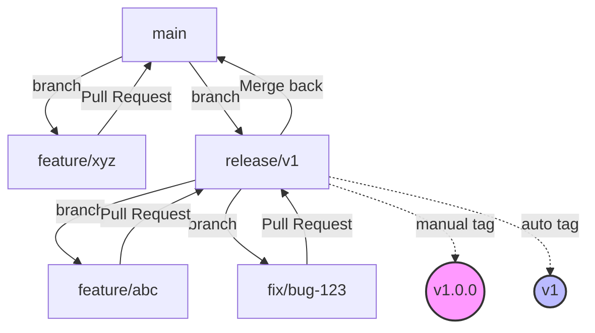

# GitHub Development and Release Process Documentation
 
## Overview
This documentation describes the process for feature development and release management in GitHub. It follows a structured approach with major version release branches and automated tag management.
 
## Process Flow
 
### 1. Feature Development on main
 
#### Create a new feature branch:
1. Open the repository in GitHub
2. Click the "main" button (branch selection)
3. Enter a new branch name (e.g., `feature/new-function`)
4. Click "Create branch: feature/new-function from 'main'"
 
#### Develop feature:
1. Switch to feature branch locally: `git checkout feature/new-function`
2. Develop the feature
3. Commit your changes regularly
 
#### Create Pull Request:
1. Go to the GitHub repository website
2. Click "Pull requests"
3. Select "New Pull Request"
4. Choose "main" as Base and your feature branch as Compare
5. Click "Create Pull Request"
6. Fill out the pull request description
7. Wait for review and merge
 
### 2. Major Version Release Branch
 
#### Create Major Release Branch:
1. Go to the repository in GitHub
2. Ensure you are on the main branch
3. Click the branch button
4. Create a new branch named `release/v1` (for major version 1)
5. Confirm with "Create branch"
 
#### Feature Development for Major Version:
1. Create feature branch from release branch:
   - Navigate to `release/v1` branch
   - Click branch button
   - Create new branch (e.g., `feature/abc` or `fix/bug-123`)
2. Develop feature or fix
3. Create pull request back to `release/v1`
 
### 3. Release Management
 
#### Creating a New Release:
1. Ensure all required changes are merged to `release/v1`
2. Go to "Releases" in the repository
3. Click "Draft a new release"
4. Click "Choose a tag" and enter specific version (e.g., "1.0.0")
5. Select target branch (`release/v1`)
6. Fill in release title
7. Add detailed release notes
8. Click "Publish release"
 
#### Merge back to main:
1. After release, create a pull request
2. Base: main, Compare: release/v1
3. Title: "Merge release v1.x.x back to main"
4. Create pull request
5. Merge after successful review
 
## Release Checklist
- [ ] All changes merged to release branch
- [ ] Release created via GitHub UI with specific version tag
- [ ] Release notes published
- [ ] Automated workflow completed (major version tag updated)
- [ ] Changes merged back to main
 
## Important Notes
- Major version branches (e.g., `release/vX`) are long-lived
- Specific version tags (e.g., v3.4.2) are created manually via UI
- Major version tags (e.g., v1) are managed automatically
- When referencing dependencies:
  - Use `@vX.Y.Z` for exact version (stable)
  - Use `@vX` for latest release in major version (auto-updating)
- Always merge release changes back to main
 
## Graphical Representation
 
