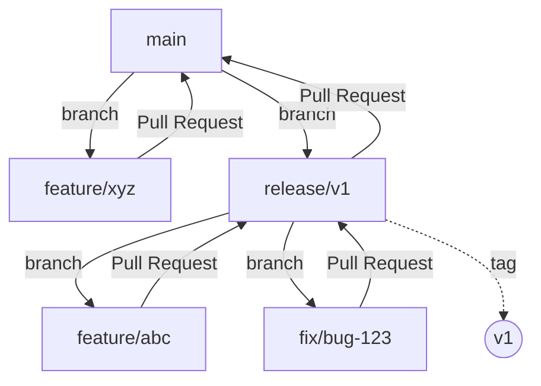

# GitHub Development and Release Process Documentation
 
## Overview
This documentation describes the process for feature development and release management in GitHub. The process ensures structured development and controlled publication of software versions.
 
## Process Flow
 
### 1. Feature Development on main
 
#### Create a new feature branch:
1. Open the repository in GitHub
2. Click the "main" button (branch selection)
3. Enter a new branch name (e.g., `feature/new-function`)
4. Click "Create branch: feature/new-function from 'main'"
 
#### Develop feature:
1. Switch to feature branch locally: `git checkout feature/new-function`
2. Develop the feature
3. Commit your changes regularly
 
#### Create Pull Request:
1. Go to the GitHub repository website
2. Click "Pull requests"
3. Select "New Pull Request"
4. Choose "main" as Base and your feature branch as Compare
5. Click "Create Pull Request"
6. Fill out the pull request description
7. Wait for review and merge
 
### 2. Release Process
 
#### Create a Release Branch:
1. Ensure you are on the main branch
2. Click the branch button
3. Create a new branch: `release/v1`
4. Confirm with "Create branch"
 
#### Feature for specific release version:
1. Create a feature branch from the release branch:
   - Choose `release/v1` as base
   - Name the branch e.g., `feature/release-v1-bugfix`
2. Develop the feature
3. Create a pull request back to the release branch
 
#### Create Release:
1. Go to "Releases" in the repository
2. Click "Draft a new release"
3. Select the release branch
4. Create a tag (e.g., "v1")
5. Fill in release notes
6. Click "Publish release"
 
#### Merge changes back to main:
1. Create a pull request
2. Base: main, Compare: release/v1
3. Title: "Merge release v1 back to main"
4. Create the pull request
5. Merge after successful review
 
## Important Notes
- Use meaningful branch names
- Follow version conventions (Semantic Versioning)
- Document changes carefully in pull requests
- Ensure all changes from release branches are merged back to main

## Branch structure

